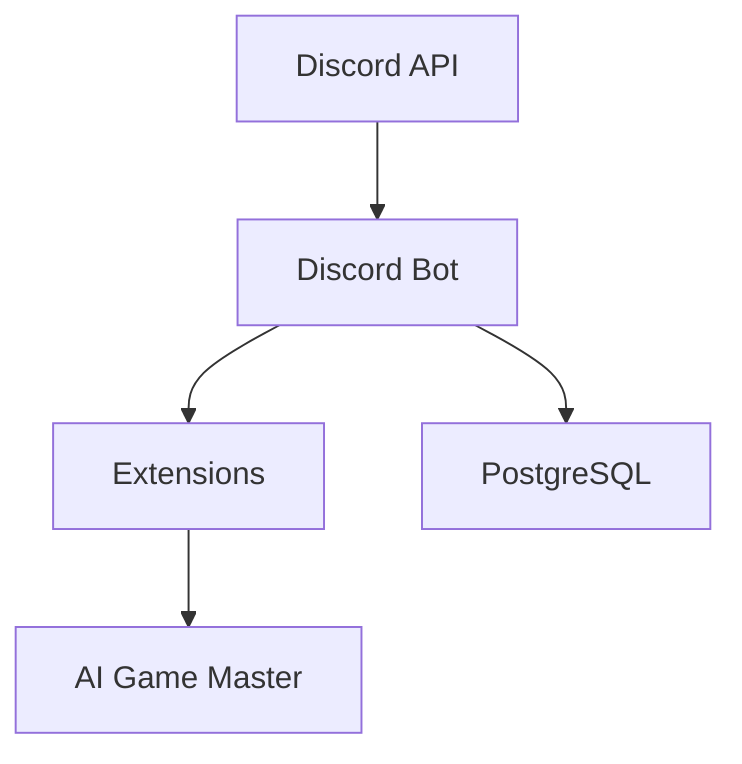
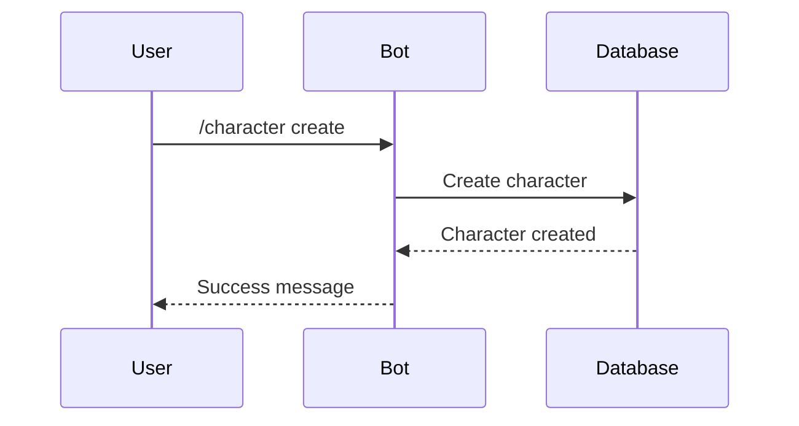
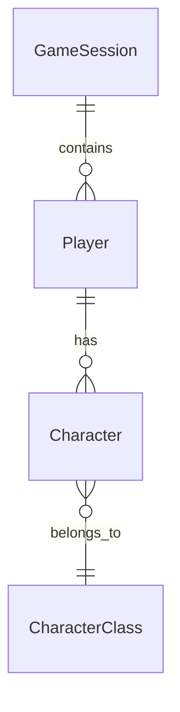

# Documentation Standards

## Principles

1. **Keep documentation concise and up to date**
   - Documentation must reflect the current state of the codebase
   - Remove outdated information immediately
   - Update docs when making code changes
   - Prefer brevity over verbosity

2. **Use Mermaid diagrams for visual documentation**
   - Use Mermaid syntax for architecture diagrams, flowcharts, and system designs
   - Keep diagrams simple and focused
   - Update diagrams when architecture changes

3. **Documentation structure**
   - Each major feature/component should have documentation
   - Include code examples where helpful
   - Link related documentation
   - Maintain a clear hierarchy

## Documentation Requirements

### When to Update Documentation

- **Code changes**: Update relevant docs immediately
- **New features**: Add documentation before or with the feature
- **API changes**: Update API reference immediately
- **Configuration changes**: Update configuration guide
- **Architecture changes**: Update architecture docs and diagrams

### Documentation Quality Checklist

- [ ] Is the information current and accurate?
- [ ] Are code examples working and tested?
- [ ] Are diagrams up to date with current architecture?
- [ ] Is the documentation concise (no unnecessary verbosity)?
- [ ] Are links between docs working?
- [ ] Is the structure logical and easy to navigate?

## Mermaid Diagram Guidelines

### When to Use Diagrams

- System architecture overview
- Data flow between components
- Database schema relationships
- Command/request flow
- State machines or workflows

### Mermaid Syntax Examples

**System Architecture:**


**Data Flow:**


**Database Schema:**


### Diagram Best Practices

- Keep diagrams focused on one concept
- Use clear, descriptive labels
- Maintain consistent styling
- Update diagrams when architecture changes
- Include diagrams in relevant documentation files

## Documentation File Standards

### Markdown Formatting

- Use proper heading hierarchy (H1 for title, H2 for sections, etc.)
- Use code blocks with language specification
- Use lists for step-by-step instructions
- Use tables for structured data
- Use blockquotes for important notes

### Code Examples

- Always include working code examples
- Show both simple and complex use cases
- Include error handling examples where relevant
- Test all code examples before committing

### Keeping Docs Updated

1. **During development:**
   - Update docs as you code
   - Don't leave "TODO: update docs" comments
   - Review docs in PR checklist

2. **Before releases:**
   - Review all documentation
   - Update version numbers if applicable
   - Verify all links work
   - Check diagrams are current

3. **Regular maintenance:**
   - Review docs quarterly
   - Remove outdated sections
   - Consolidate duplicate information
   - Improve clarity based on user feedback

## Documentation Review Process

When reviewing PRs:
- Check if documentation needs updates
- Verify code examples work
- Ensure diagrams reflect current state
- Confirm links are valid
- Check for typos and clarity

## File Organization

- Keep documentation in `docs/` directory
- Use descriptive filenames
- Group related documentation together
- Maintain an index/README in docs/

## Examples

### Good Documentation

```markdown
## Creating a Character

Use `/character create` to create a new character:

1. Select a character class
2. Enter character name
3. Character is created

**Example:**
```
/character create
```

**Limits:** Maximum 3 characters per player (configurable).
```

### Bad Documentation

```markdown
## Creating a Character

This is a very long explanation that goes into unnecessary detail about
the history of character creation, why we chose this approach, various
edge cases that don't matter, and outdated information from when we used
a different system. Also, here's a code example that doesn't work anymore.
```

## Related Rules

- See [Project Standards](project-standards/RULE.md) for general coding standards
- See [Models & Repositories](models-repositories/RULE.md) for model documentation
- See [Alembic Migrations](alembic-migrations/RULE.md) for migration documentation

