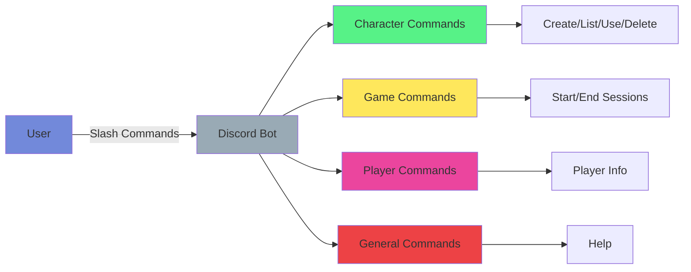
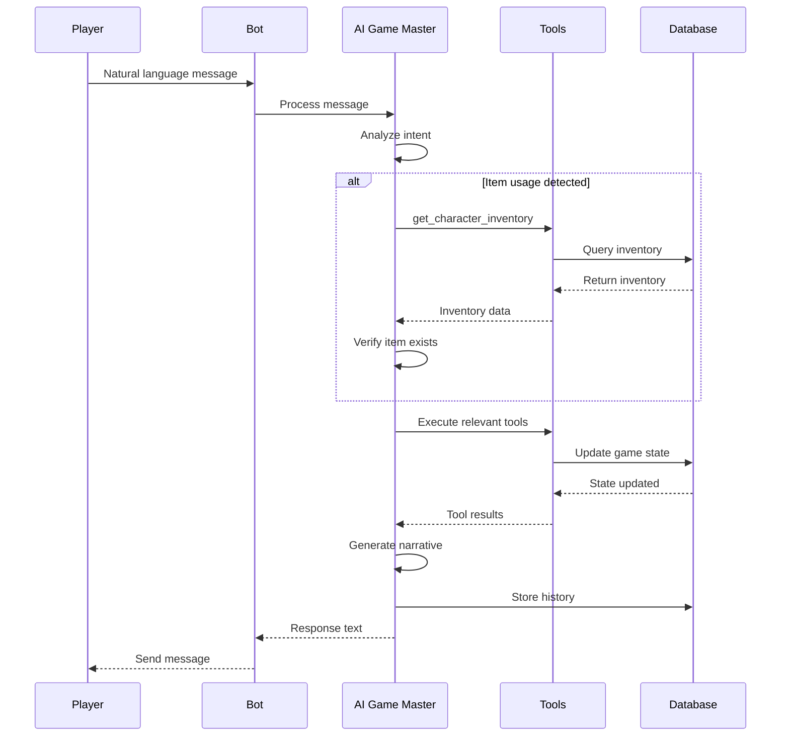

# API Reference

This document provides a reference for all Discord bot commands and features.

## Command Overview

The bot uses Discord slash commands (application commands) for user interaction. All commands are prefixed with `/`.

## Command Groups

### Character Commands (`/character`)

Manage your characters in the game.

#### `/character create`
Create a new character.

- Opens a character class selection menu
- After selecting a class, opens a character creation modal
- Requires: Character name
- Limits: Based on `max_characters_per_player` setting

#### `/character list`
List all your characters.

- Shows all characters you've created
- Displays character details including class, stats, and active status
- Uses ephemeral messages (only visible to you)

#### `/character use <name>`
Set a character as your active character.

- Switches your active character
- Only one character can be active at a time
- Required for joining game sessions

#### `/character delete <name>`
Delete a character.

- Permanently removes a character
- Cannot delete character while in an active game session
- Use `/game end` first if needed

### Game Commands (`/game`)

Manage game sessions.

#### `/game start`
Start a new game session.

- Creates a new game session channel
- Moves you to the game channel
- Requires an active character (use `/character use`)
- Maximum players per session: Configurable (default: 4)

#### `/game end`
End the current game session.

- Closes the game session
- Deletes the game channel
- Moves players back to the join channel
- Only the session creator can end it

#### `/game open`
Open a game session to all players.

- Makes the session publicly joinable
- Players can join via `/game join`

#### `/game close`
Close a game session to new players.

- Prevents new players from joining
- Existing players remain in the session

#### `/game add <player>`
Add a player to your game session.

- Adds a player by mention or user ID
- Sends welcome DM to new players
- Creates invite link if player is not in server
- Only session creator can add players
- Enforces session capacity limits

#### `/game remove <player>`
Remove a player from your game session.

- Removes a player from the session
- Only session creator can remove players

#### `/game leave`
Leave a game session.

- Removes you from the current session
- If you're the creator, the session ends

### Player Commands (`/player`)

Player-related commands.

#### `/player help`
Get help with player commands.

- Lists all available player commands
- Shows command descriptions

### Admin Commands (`/admin`)

Administrative commands (requires administrator permissions).

#### `/admin memory health`
Check memory system health.

- Displays statistics on session, episode, and world memories
- Shows warnings for potential issues
- Provides memory system status

#### `/admin memory settings view`
View current memory settings.

- Shows memory expiration times
- Displays cleanup configuration

#### `/admin memory settings update`
Update memory settings.

- Configure session/episode expiration times
- Set snapshot retention period
- Enable/disable auto cleanup

#### `/admin world time current`
Show current game time.

- Displays current game time, date, and cycle

#### `/admin world validation validate-travel`
Validate travel between locations.

- Checks if travel is valid based on geography
- Validates against location facts

#### `/admin world validation add-fact`
Add a location fact.

- Adds geographic or lore facts about locations
- Used for travel validation

#### `/admin world validation get-facts`
Get facts for a location.

- Retrieves all facts about a specific location

### General Commands

#### `/help`
Get general bot help.

- Overview of the bot
- Lists all available commands grouped by category
- Provides getting started instructions

## Game Mechanics

### Character Classes

Available character classes (seeded in database):

1. **Enforcer** 🛡️
   - Physically imposing, handles physical aspects
   - Stats: Strength, Dexterity

2. **Tech Wizard** 💻
   - Master of technology and hacking
   - Stats: Intellect, Dexterity

3. **Smooth Talker** 💬
   - Face of the organization, negotiations
   - Stats: Charisma, Intellect

4. **Spy** 🕵️
   - Stealthy, intelligence gathering
   - Stats: Dexterity, Perception

5. **Wild Card** 🃏
   - Unpredictable, volatile
   - Stats: Strength, Dexterity, Intellect, Charisma, Perception

### Character Stats

- **STR** (Strength) - Physical power
- **DEX** (Dexterity) - Agility and reflexes
- **INT** (Intellect) - Reasoning and memory
- **CHA** (Charisma) - Social skills
- **PER** (Perception) - Awareness and insight
- **LUK** (Luck) - Fortune and chance (immutable)

### Character Cooldowns

- **Cooldown System**: Tracks cooldowns on skills, abilities, and items
- **Automatic Tracking**: Cooldowns are automatically set when abilities/items are used
- **Cooldown Checks**: AI Game Master checks cooldowns before allowing actions
- **Cooldown Types**: Skill cooldowns, ability cooldowns, item cooldowns

### Location System

- **Location Graph**: Dynamic location nodes and edges
- **Travel Validation**: Geography-based travel validation
- **Location Facts**: Geographic and lore facts about locations
- **Dynamic Creation**: Locations can be created during gameplay
- **POI Generation**: Points of interest generated dynamically

### Game Sessions

- **Session Creation**: Players join via voice channel or `/game join`
- **Session Channels**: Each session gets a dedicated text channel
- **Player Management**: Session creators can add/remove players
- **Session Capacity**: Configurable max players per session
- **Session States**: Open (anyone can join) or closed (invite only)
- **AI Game Master**: Responds to player messages in natural language
- **Idle Timeout**: Sessions auto-close after idle period (preserved across restarts)
- **Welcome Messages**: New players receive welcome DMs

## AI Game Master

The AI game master uses natural language processing to:

- Respond to player actions and dialogue
- Manage game state (inventory, credits, quests)
- Generate NPCs and narrative content
- Enforce game rules and mechanics

### Interaction Flow

### Interaction

Players interact with the game master by typing natural language messages in the game session channel. The AI:

1. Analyzes the message
2. Checks character inventory/state if needed
3. Generates appropriate narrative response
4. Updates game state as necessary

### Available Actions

The AI can handle actions like:
- Using items (checks inventory and cooldowns first)
- Interacting with NPCs
- Exploring locations
- Traveling between locations (validated against geography)
- Combat encounters (with rewards and experience)
- Quest progression
- Credit transactions
- Searching corpses for loot
- Character ability usage (with cooldown checks)

### Memory System Integration

The AI Game Master has access to:
- **Session Memory**: Recent events in the current session
- **Episode Memory**: Condensed summaries of past sessions
- **World Memory**: Permanent world lore and history
- **Semantic Search**: Finds relevant context through meaning
- **Memory Compression**: Intelligent compression reduces context size
- **Location Context**: Location-specific memories and facts

## Permissions

### Required Bot Permissions

- View Channels
- Send Messages
- Manage Messages
- Read Message History
- Use Slash Commands
- Connect (Voice Channels)
- Move Members (Voice Channels)
- Manage Channels (for game sessions)

### User Permissions

- All users can create characters and join games
- Some commands may require specific roles (future feature)

## Error Messages

Common error messages and their meanings:

- **"No character classes are available"** - Database not seeded, run `make seed`
- **"Character creation channel not found"** - Bot can't find the character creation channel
- **"You have reached the maximum number of characters"** - Delete a character first
- **"You are currently in a game session"** - End current session before starting new one

## Rate Limiting

Discord enforces rate limits on:
- Slash commands: Varies by command type
- Message sending: 5 messages per 5 seconds per channel
- API requests: 50 requests per second

The bot handles rate limits automatically with retries.

## Extending Commands

To add new commands, see the [Development Guide](development.md) and [Architecture Guide](architecture.md).

## Related Documentation

- [Installation Guide](installation.md) - Setting up the bot
- [Configuration Guide](configuration.md) - Configuring the bot
- [Development Guide](development.md) - Adding new features

