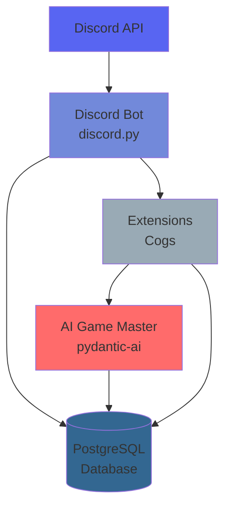
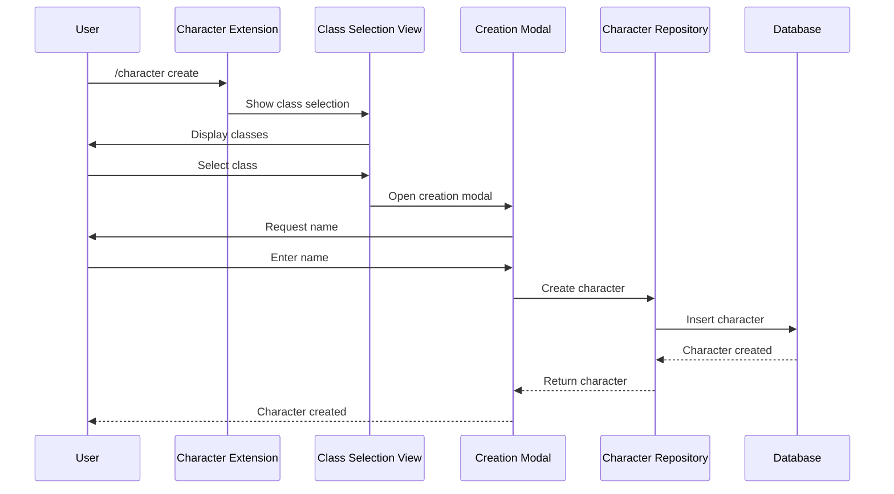
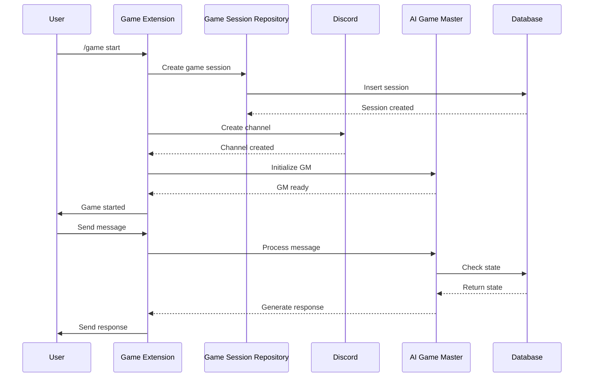
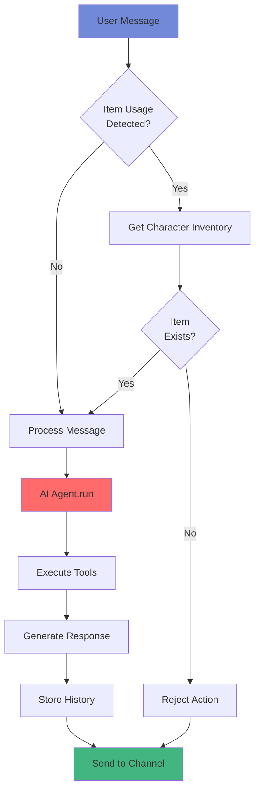
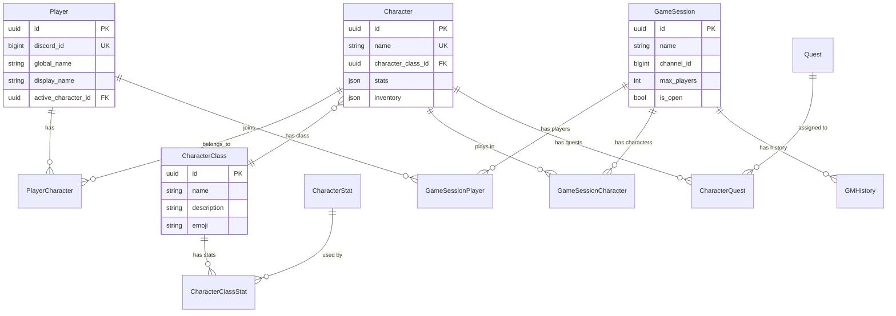

# Architecture Documentation

This document describes the architecture of the Quillian Undercity Discord bot.

## System Overview

The bot is built as a modular Discord bot using discord.py, with a PostgreSQL database backend and AI-powered game master functionality.



## Core Components

### 1. Discord Bot (`ds_discord_bot`)

The main bot application built on discord.py.

**Key Files:**
- `bot.py` - Main `DSBot` class extending `commands.AutoShardedBot`
- `postgres_manager.py` - Database connection and session management
- `__init__.py` - Bot initialization and startup

**Responsibilities:**
- Discord API communication
- Extension/cog loading
- Event handling
- Command routing

### 2. Extensions (`ds_discord_bot/extensions`)

Modular command groups (cogs) that handle different bot features.

**Available Extensions:**
- `admin.py` - Administrative commands
- `character.py` - Character creation and management
- `game.py` - Game session management and AI game master
- `general.py` - General bot commands
- `moderation.py` - Moderation tools
- `player.py` - Player management
- `welcome.py` - Welcome messages and user syncing

**Extension Structure:**
```python
class MyExtension(commands.Cog):
    def __init__(self, bot: commands.Bot, postgres_manager: PostgresManager):
        self.bot = bot
        self.postgres_manager = postgres_manager
    
    @app_commands.command()
    async def my_command(self, interaction: discord.Interaction):
        # Command implementation
```

### 3. Data Models (`ds_common/models`)

SQLModel classes representing database entities.

**Key Models:**
- `BaseSQLModel` - Base class with common fields (id, created_at, updated_at)
- `Player` - Discord user representation
- `Character` - Player characters
- `CharacterClass` - Character classes (Enforcer, Tech Wizard, etc.)
- `CharacterStat` - Character statistics (STR, DEX, INT, etc.)
- `CharacterCooldown` - Character ability/item cooldowns
- `GameSession` - Active game sessions
- `GMHistory` - AI game master interaction history
- `NPC` - Non-player characters
- `Quest` - Quest definitions
- `LocationNode` - Location nodes in the world graph
- `LocationEdge` - Connections between locations
- `LocationFact` - Geographic and lore facts about locations
- `GameTime` - Persistent game time with fast-forward support
- `WorldEvent` - Dynamic world events
- `CalendarEvent` - Calendar-based events
- `WorldRegion` - Geographic regions
- `WorldItem` - Items that exist in the world
- `SessionMemory` - Short-term session memories
- `EpisodeMemory` - Condensed episode memories
- `WorldMemory` - Permanent world memories
- `MemorySettings` - Memory system configuration

**Model Relationships:**
- Players ↔ Characters (many-to-many via `PlayerCharacter` junction table)
- Characters ↔ CharacterClasses (many-to-one)
- Characters ↔ CharacterStats (many-to-many via `CharacterClassStat`)
- GameSessions ↔ Players (many-to-many via `GameSessionPlayer`)
- GameSessions ↔ Characters (many-to-many via `GameSessionCharacter`)

### 4. Repository Layer (`ds_common/repository`)

Data access layer providing CRUD operations and business logic.

**Pattern:**
- All repositories inherit from `BaseRepository[T]`
- Use async SQLAlchemy sessions
- Provide typed, consistent API

**Example:**
```python
class CharacterRepository(BaseRepository[Character]):
    async def get_by_name(self, name: str) -> Character | None:
        return await self.get_by_("name", name)
```

### 5. Memory System (`ds_common/memory`)

Three-tier memory architecture for narrative persistence:
- **Session Memory**: Raw events during gameplay (1-4 hours)
- **Episode Memory**: Condensed narrative summaries (24-72 hours)
- **World Memory**: Permanent historical record

**Key Services:**
- `memory_processor.py` - Core memory processing and AI agents
- `memory_retriever.py` - Semantic search and context retrieval
- `memory_compressor.py` - Intelligent memory compression
- `embedding_service.py` - Embedding generation with Redis caching
- `game_time_service.py` - Game time management and persistence
- `background_tasks.py` - Background processing (cleanup, time advancement)
- `location_graph_service.py` - Location graph management
- `validators/` - World consistency and geography validation

**AI Agents:**
- `importance_agent.py` - Real-time importance scoring
- `episode_agent.py` - Episode summarization
- `world_memory_agent.py` - World memory promotion
- `safeguard_agent.py` - Content safety validation

### 6. Combat System (`ds_common/combat`)

Combat mechanics and rewards:
- `cooldown_service.py` - Character cooldown management
- `experience_service.py` - Experience distribution
- `loot_generator.py` - Loot generation from encounters
- `damage_handler.py` - Damage calculation
- `restoration_service.py` - Health/mana restoration

### 7. World Generation (`ds_common/world_generation`)

Dynamic world generation:
- `poi_generator.py` - Point of interest generation
- `edge_generator.py` - Location edge generation
- `theme_system.py` - Thematic world generation
- `character_association_generator.py` - Character-location associations

### 8. Database Migrations (`alembic/`)

Alembic-based schema versioning and migrations.

**Structure:**
- `env.py` - Alembic configuration
- `versions/` - Migration files
- `alembic.ini` - Alembic settings

**Migration Workflow:**
1. Modify models
2. Generate migration: `make migrate-create MSG="description"`
3. Review and edit if needed
4. Apply: `make migrate`

**Database Management:**
- `make migrate-downgrade-base` - Downgrade to base migration
- `make db-reset` - Reset database (drops and recreates)

## Data Flow

### Character Creation Flow



### Game Session Flow



### AI Game Master Flow



## Database Schema

### Entity Relationship Diagram



### Key Tables

- **players** - Discord users
- **characters** - Player characters
- **character_classes** - Character class definitions
- **character_stats** - Stat definitions
- **character_cooldowns** - Character ability/item cooldowns
- **game_sessions** - Active game sessions
- **gm_history** - AI interaction history
- **location_nodes** - Location nodes in the world graph
- **location_edges** - Connections between locations
- **location_facts** - Geographic and lore facts
- **game_time** - Persistent game time
- **world_events** - Dynamic world events
- **calendar_events** - Calendar-based events
- **calendar_months** - Calendar month definitions
- **calendar_year_cycles** - Year cycle definitions
- **world_regions** - Geographic regions
- **world_items** - Items in the world
- **session_memories** - Short-term session memories
- **episode_memories** - Condensed episode memories
- **world_memories** - Permanent world memories
- **memory_settings** - Memory system configuration
- **encounters** - Combat encounters
- **player_characters** - Junction table (many-to-many)
- **game_session_players** - Junction table
- **game_session_characters** - Junction table

### Relationships

- Circular dependency handled: `Player` ↔ `Character` uses junction table
- All foreign keys properly indexed
- UTC timezone-aware timestamps throughout

## AI Game Master

The AI game master uses pydantic-ai to create dynamic narratives.

**Components:**
- **Agent** - Main AI agent with tools and system prompts
- **Tools** - Functions the AI can call (get inventory, adjust credits, etc.)
- **System Prompts** - Context and instructions for the AI (dynamically loaded based on context)
- **Message History** - Maintains conversation context
- **Prompt Analyzer** - AI-based intent classification for contextual prompt loading
- **Memory Context** - Compressed memory context prepended to messages

**Tools Available:**
- `fetch_npc` - Generate or retrieve NPCs
- `get_character_credits` - Check character credits
- `adjust_character_credits` - Modify credits
- `get_character_inventory` - Check inventory
- `add_character_item` - Add items to inventory
- `remove_character_item` - Remove items from inventory
- `add_character_quest` - Assign quests
- `check_character_cooldown` - Check if ability/item is on cooldown
- `set_character_cooldown` - Set cooldown for ability/item
- `get_character_location` - Get character's current location
- `update_character_location` - Update character location
- `create_location_node` - Create new location dynamically
- `create_location_edge` - Create connection between locations
- `get_location_facts` - Get facts about a location
- `distribute_encounter_rewards` - Distribute XP and loot from encounters
- `search_corpse` - Search dead NPCs for loot

**Prompt System:**
- **Contextual Loading**: AI analyzes user messages to determine which prompt modules to load
- **Modular Prompts**: Separate prompt files for different contexts (combat, travel, inventory, etc.)
- **Caching**: Prompt modules are cached for performance
- **Dynamic Context**: Only relevant prompts are loaded based on current game state

## Security Considerations

- Discord tokens stored in environment variables
- Database credentials in environment variables
- Input validation on all user inputs
- SQL injection prevention via SQLAlchemy parameterization
- Foreign key constraints for data integrity

## Performance Considerations

- **Connection Pooling**: Database connections pooled for efficiency
- **Async/Await**: Non-blocking operations throughout
- **Indexing**: Foreign keys and vector columns properly indexed
- **Memory Compression**: Intelligent compression reduces AI context size
- **Redis Caching**: Embeddings and prompts cached in Redis
- **Semantic Search**: pgvector for efficient similarity search
- **Background Tasks**: Cleanup and processing run asynchronously
- **Game Time Persistence**: Fast-forward on startup, periodic saves
- **Message History**: Limited to last 20 messages in memory
- **Database Queries**: Optimized with proper indexing and query patterns

## Extension Points

### Adding New Commands

Add to existing extension or create new extension:

```python
@app_commands.command(name="newcommand")
async def new_command(self, interaction: discord.Interaction):
    # Implementation
```

### Adding New Models

1. Create model in `ds_common/models/`
2. Create repository in `ds_common/repository/`
3. Add to Alembic imports in `alembic/env.py`
4. Create migration: `make migrate-create MSG="Add NewModel"`
5. Apply migration: `make migrate`

### Adding New AI Tools

Add to `_create_tools()` in `game.py`:

```python
async def my_new_tool(
    ctx: RunContext[GMAgentDependencies],
    request: MyRequest,
) -> MyResponse:
    """Tool description for AI."""
    # Implementation
```

### Adding New Prompt Modules

1. Create prompt file in `src/ds_discord_bot/extensions/prompts/modules/`
2. Add keywords and context to `prompt_analyzer.py`
3. Prompt will be automatically loaded when relevant context is detected

### Adding New Memory Agents

1. Create agent in `ds_common/memory/agents/`
2. Add to `memory_processor.py` processing pipeline
3. Define Pydantic models for agent outputs
4. Configure in memory settings

## Related Documentation

- [Development Guide](development.md) - Development workflow
- [API Reference](api.md) - Bot commands
- [Migrations Guide](migrations.md) - Database migrations

