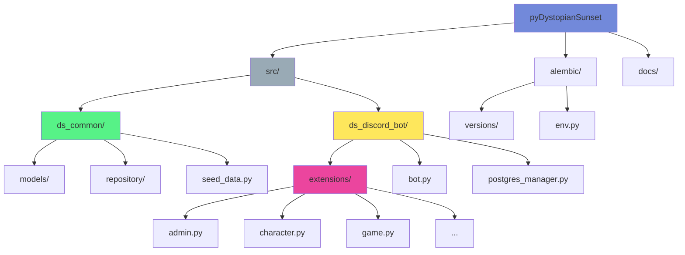

# Development Guide

This guide covers the development workflow, coding standards, and best practices for contributing to Quillian Undercity.

## Development Setup

### Prerequisites

1. Install development dependencies:
   ```bash
   make install-dev
   ```

2. Start development services:
   ```bash
   make services-up
   ```

3. Run migrations and seed data:
   ```bash
   make migrate
   make seed
   ```

### Running in Development Mode

Use the development runner with auto-reload:

```bash
make run-dev
```

This will:
- Watch for file changes in `src/`
- Automatically restart the bot when files are modified
- Use `watchfiles` for fast file watching

## Code Quality Tools

### Formatting

Format code with ruff:
```bash
make format
```

Check formatting without changes:
```bash
make format-check
```

### Linting

Lint code:
```bash
make lint
```

Auto-fix linting issues:
```bash
make lint-fix
```

### Type Checking

Run mypy type checking:
```bash
make typecheck
```

### Running All Checks

Run all quality checks:
```bash
make check-all
```

Or fix all issues:
```bash
make fix-all
```

## Testing

Run tests:
```bash
make test
```

Run tests with coverage:
```bash
make test-cov
```

Fast tests (no coverage):
```bash
make test-fast
```

## Project Structure



## Coding Standards

### Python Style

- Follow PEP 8
- Use type hints for all function parameters and return values
- Maximum line length: 100 characters
- Use `ruff` for formatting and linting

### SQLModel Models

- All models inherit from `BaseSQLModel`
- Use `table=True` for database models
- Use `Field()` with appropriate constraints
- Use `Relationship()` for associations
- All datetime fields must be timezone-aware (UTC)

Example:
```python
class Character(BaseSQLModel, table=True):
    name: str = Field(unique=True, index=True)
    created_at: datetime = Field(
        sa_type=DateTime(timezone=True),
        default_factory=lambda: datetime.now(UTC)
    )
```

### Repositories

- All repositories inherit from `BaseRepository[T]`
- Use async/await for all database operations
- Use `AsyncSession.execute()` (not `exec()`)
- Handle errors appropriately

Example:
```python
async def get_by_name(self, name: str) -> Character | None:
    stmt = select(Character).where(Character.name == name)
    result = await sess.execute(stmt)
    return result.scalar_one_or_none()
```

### Discord Extensions

- Each extension is a `commands.Cog`
- Use `@app_commands.command()` for slash commands
- Use `@commands.Cog.listener()` for event handlers
- Handle errors gracefully with user-friendly messages

Example:
```python
class MyExtension(commands.Cog):
    def __init__(self, bot: commands.Bot, postgres_manager: PostgresManager):
        self.bot = bot
        self.postgres_manager = postgres_manager
    
    @app_commands.command(name="mycommand")
    async def my_command(self, interaction: discord.Interaction):
        await interaction.response.send_message("Hello!")
```

## Database Migrations

### Creating Migrations

1. Modify your models
2. Create migration:
   ```bash
   make migrate-create MSG="Description of changes"
   ```
3. Review the generated migration
4. Apply it:
   ```bash
   make migrate
   ```

See [Migrations Guide](migrations.md) for details.

## Git Workflow

1. Create a feature branch:
   ```bash
   git checkout -b feature/my-feature
   ```

2. Make your changes

3. Run quality checks:
   ```bash
   make check-all
   ```

4. Commit with descriptive messages:
   ```bash
   git commit -m "Add feature: description"
   ```

5. Push and create a pull request

## Common Development Tasks

### Adding a New Model

1. Create model in `src/ds_common/models/`
2. Create repository in `src/ds_common/repository/`
3. Import model in `alembic/env.py`
4. Create migration: `make migrate-create MSG="Add NewModel"`
5. Apply migration: `make migrate`

### Adding a New Bot Command

1. Add command to appropriate extension in `src/ds_discord_bot/extensions/`
2. Use `@app_commands.command()` decorator
3. Handle errors appropriately
4. Test the command in Discord

### Adding a New Extension

1. Create new file in `src/ds_discord_bot/extensions/`
2. Create a `Cog` class
3. Add `setup()` function
4. Register in `src/ds_discord_bot/extensions/__init__.py`

## Debugging

### Enable SQL Logging

Set in `.env`:
```bash
DS_POSTGRES_ECHO="true"
```

### Enable Debug Logging

Set in `.env`:
```bash
DS_LOG_LEVEL="DEBUG"
```

### Using a Debugger

The bot can be run with a debugger. Set breakpoints in your IDE and run:
```bash
uv run python -m ds_discord_bot.bot
```

## Pre-commit Checklist

Before committing, ensure:

- [ ] Code is formatted: `make format`
- [ ] Linting passes: `make lint`
- [ ] Type checking passes: `make typecheck`
- [ ] Tests pass: `make test`
- [ ] Migrations are created if models changed
- [ ] Documentation is updated if needed

## Related Documentation

- [Architecture Guide](architecture.md) - System design
- [API Reference](api.md) - Bot commands
- [Migrations Guide](migrations.md) - Database migrations

