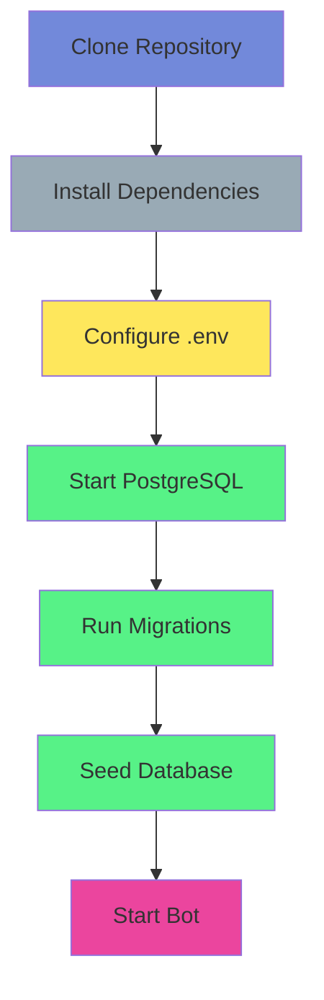

# Installation Guide

This guide will walk you through setting up the Quillian Undercity Discord bot from scratch.

## Prerequisites

Before you begin, ensure you have the following installed:

- **Python 3.13+** - Check with `python3 --version`
- **[uv](https://github.com/astral-sh/uv)** - Fast Python package manager (recommended)
  - Install: `curl -LsSf https://astral.sh/uv/install.sh | sh`
- **Docker or Podman** - For running PostgreSQL
- **Discord Bot Token** - Create a bot at [Discord Developer Portal](https://discord.com/developers/applications)

## Installation Flow



## Step-by-Step Installation

### 1. Clone the Repository

```bash
git clone <repository-url>
cd pyDystopianSunset
```

### 2. Install Dependencies

Using `uv` (recommended):
```bash
make install-dev
# or
uv sync --extra dev
```

Using `pip`:
```bash
pip install -e ".[dev]"
```

### 3. Configure Environment Variables

Copy the example environment file:
```bash
cp .env.example .env
```

Edit `.env` and configure at minimum:
- `DS_DISCORD_TOKEN` - Your Discord bot token (required)
- PostgreSQL settings if not using defaults

See [Configuration Guide](configuration.md) for all available options.

### 4. Start PostgreSQL Database

Start the database using Docker Compose:
```bash
make services-up
# or
docker-compose up -d
```

Verify PostgreSQL is running:
```bash
docker-compose ps
```

### 5. Run Database Migrations

Apply all database migrations:
```bash
make migrate
# or
uv run alembic upgrade head
```

### 6. Seed Initial Data

Populate the database with character classes, stats, and other game data:
```bash
make seed
# or
uv run python -m ds_common.seed_data
```

### 7. Start the Bot

For production:
```bash
make run
# or
uv run python -m ds_discord_bot.bot
```

For development (with auto-reload):
```bash
make run-dev
# or
uv run python -m ds_discord_bot.dev_runner
```

## Verification

Once the bot is running, you should see:
- Bot logs indicating successful connection to Discord
- Bot appears online in your Discord server
- `/help` command works in Discord

## Troubleshooting

### Bot won't start
- Check that `DS_DISCORD_TOKEN` is set correctly in `.env`
- Verify PostgreSQL is running: `docker-compose ps`
- Check logs for specific error messages

### Database connection errors
- Ensure PostgreSQL container is running: `make services-up`
- Verify database credentials in `.env` match docker-compose.yaml
- Check PostgreSQL logs: `docker-compose logs postgres`

### Migration errors
- Ensure database is running before migrations
- Check current migration: `make migrate-current`
- See [Migrations Guide](migrations.md) for more help

### Missing character classes
- Run the seed script: `make seed`
- Verify seed data was created: Check database or try creating a character

## Next Steps

- Read the [Configuration Guide](configuration.md) to customize settings
- Check the [Development Guide](development.md) for development workflow
- Review [API Reference](api.md) for available bot commands

