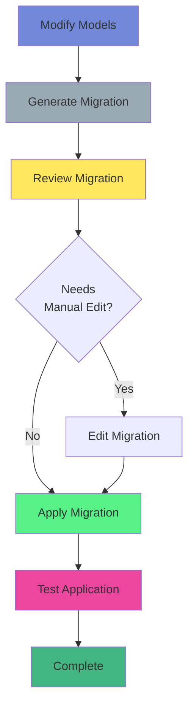

# Database Migrations Guide

This guide covers working with Alembic database migrations in the Quillian Undercity project.

## Overview

The project uses [Alembic](https://alembic.sqlalchemy.org/) for database schema migrations. Migrations are stored in `alembic/versions/` and track all changes to the database schema.

## Quick Reference

```bash
# Apply all pending migrations
make migrate

# Create a new migration
make migrate-create MSG="description"

# Check current migration
make migrate-current

# View migration history
make migrate-history

# Rollback last migration
make migrate-downgrade

# Check if database is up to date
make migrate-check
```

## Common Tasks

### Applying Migrations

After pulling new code or creating migrations, apply them:

```bash
make migrate
# or
uv run alembic upgrade head
```

This applies all pending migrations to bring your database to the latest schema.

### Creating a New Migration

When you modify models, create a migration:

```bash
make migrate-create MSG="Add user preferences table"
# or
uv run alembic revision --autogenerate -m "Add user preferences table"
```

**Important:** The database must be running and accessible for autogenerate to work, as Alembic compares the current database schema with your models.

### Checking Migration Status

See what migration your database is currently on:

```bash
make migrate-current
# or
uv run alembic current
```

### Viewing Migration History

See all migrations and their order:

```bash
make migrate-history
# or
uv run alembic history
```

### Rolling Back Migrations

Rollback the last migration:

```bash
make migrate-downgrade
# or
uv run alembic downgrade -1
```

**Warning:** Only rollback in development. Production rollbacks can cause data loss.

### Checking for Pending Migrations

Verify if your database is up to date:

```bash
make migrate-check
# or
uv run alembic check
```

## Migration Workflow



### 1. Modify Models

Edit your SQLModel classes in `src/ds_common/models/`:

```python
class User(BaseSQLModel, table=True):
    # Add new field
    email: str = Field(unique=True, index=True)
```

### 2. Create Migration

Generate a migration that captures your changes:

```bash
make migrate-create MSG="Add email field to User"
```

### 3. Review Migration

Check the generated migration file in `alembic/versions/`:

```python
def upgrade() -> None:
    op.add_column('users', sa.Column('email', sa.String(), nullable=False))
    op.create_unique_constraint('uq_users_email', 'users', ['email'])
    op.create_index('ix_users_email', 'users', ['email'])
```

### 4. Apply Migration

Apply the migration to your database:

```bash
make migrate
```

### 5. Test

Verify the migration worked correctly and test your application.

## Manual Migrations

Sometimes you need to manually edit migrations, especially for:
- Data migrations (moving/transforming data)
- Complex schema changes
- Custom SQL operations

Example manual migration:

```python
def upgrade() -> None:
    # Migrate existing data
    op.execute("""
        UPDATE users
        SET email = username || '@example.com'
        WHERE email IS NULL
    """)
    
    # Then add constraint
    op.alter_column('users', 'email', nullable=False)
```

## Best Practices

1. **Always review autogenerated migrations** - Alembic can miss some changes
2. **Test migrations on a copy of production data** - Ensure they work correctly
3. **Keep migrations small and focused** - One logical change per migration
4. **Never edit applied migrations** - Create a new migration to fix issues
5. **Document complex migrations** - Add comments explaining why changes were made
6. **Use transactions** - Alembic wraps migrations in transactions by default

## Troubleshooting

### "Target database is not up to date"
Your database has pending migrations. Apply them:
```bash
make migrate
```

### "Can't locate revision identified by 'xyz'"
Your migration history is out of sync. Check:
```bash
make migrate-current
make migrate-history
```

### "Multiple heads detected"
You have multiple migration branches. Merge them:
```bash
uv run alembic merge -m "Merge branches" head1 head2
```

### Migration fails to apply
1. Check database logs for specific errors
2. Verify database connection settings
3. Ensure all dependencies are installed
4. Check if manual intervention is needed (data conflicts, etc.)

## Migration File Structure

Each migration file contains:

```python
"""Migration description

Revision ID: abc123
Revises: xyz789
Create Date: 2025-12-24 12:00:00
"""
from alembic import op
import sqlalchemy as sa

revision = 'abc123'
down_revision = 'xyz789'  # Previous migration
branch_labels = None
depends_on = None

def upgrade() -> None:
    """Apply this migration."""
    # Your changes here

def downgrade() -> None:
    """Rollback this migration."""
    # Reverse changes here
```

## Data Migrations

For data migrations (not just schema changes), you can use raw SQL:

```python
def upgrade() -> None:
    # Example: Migrate data from old column to new column
    op.execute("""
        UPDATE characters
        SET new_stats = old_stats::jsonb
        WHERE old_stats IS NOT NULL
    """)
```

## Related Documentation

- [Alembic Documentation](https://alembic.sqlalchemy.org/)
- [SQLAlchemy Migrations](https://docs.sqlalchemy.org/en/20/core/metadata.html)
- [Development Guide](development.md) - Development workflow

